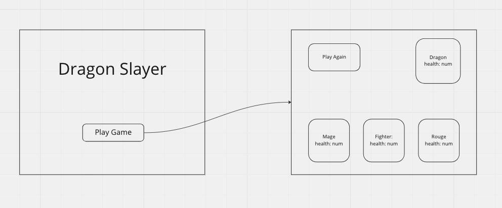

# Dragon Slayer

## Setup

1. Create a new directory called `dragon-slayer`
2. `cd` into newly created `dragon-slayer` and create 3 files:
   1. `index.js`
   2. `index.html`
   3. `index.css`
3. Add starter HTML code to `index.html`:

```html
<!DOCTYPE html>
<html lang="en">

<head>
    <meta charset="UTF-8">
    <meta http-equiv="X-UA-Compatible" content="IE=edge">
    <meta name="viewport" content="width=device-width, initial-scale=1.0">
    <link href="./index.css" rel="stylesheet" />
    <script src="./index.js" defer></script>
    <title>Dragon Slayer</title>
</head>

<body>
    <h1>Dragon Slayer</h1>
    <div id="game-board"></div>
    <button>Play Game</button>
</body>

</html>
```

4. Finally, add the starting JavaScript to your `index.js`:

```js
// saving the elements from the DOM to variables for easy look ups
const gameBoard = document.querySelector('#game-board')
const button = document.querySelector('button')

// running game set up
initialize()

// function to call any other functions to set up the game
function initialize() {
 
}

// button to start game play
button.addEventListener('click', () => {
    console.log('Playing game...')
})
```

## Project Planning

In this lecture we are going to look at how to plan a project through building the game Dragon Slayer

## Wireframing

A **wireframe** is an image that sketches out the layout of major pieces of
content within a page, without all of the fully-rendered detail that might be
present in an illustration.

.png)

Although making detailed, feature-rich wireframes is typically the province of
the UX/UI designer, even developers can produce basic layout sketches, and these
sketches are extremely useful in the planning process as a tool to clarify and
codify your vision. They also segue easily into mocking up a site with boxes, so
that you know how to actually build your layout.



### Wireframes vs Mockups

Wireframes and mockups are  ways to visualize an application.  They differ in
the the "degree" of fidelity.  Wireframes are lower fidelity, often using
placeholders for content, no colors, no fonts, and no assets.  Mockups are are
higher fidelity, often utilizing colors, typography, images, and other assets.

**Low-fidelity:**

- wireframes (paper or marker)
- wireframes (digital)

| Pros  |  Cons  |
| ------|----|
| speed | uninspiring |
| easy to change | vague |
| inexpensive | feel incomplete |
| skeleton of application | lack of guidance |

**High-fidelity:**

- mockups (no interactions)
- mockups (interactivity)

| Pros  |  Cons  |
| ------|----|
| stakeholder language | more time |
| more inspiring | harder to change  |
| user's perspective | more costly |

### Wireframing in SEI

Within the scope of this course, we will not be expecting you to produce
designer-level wireframes; however, we _will_ expect you to produce low-fidelity
sketches for your projects. A low-fidelity wireframe or sketch is simple -- just
complex enough to convey the gist of the page -- and may feature minimal text
placeholders for images, or skeletons of interactive features like drop-down
menus and pop-ups or modals.

It should usually not concern itself with things like:

- color scheme
- fonts
- specific content (images, written copy, etc)
- animations and timing

If you find yourself diving into those details, you may be going too deep. The
purpose of a sketch is to be light, flexible, and even disposable if necessary.

## Lab: Wireframe Practice

Pick one of the eight following sites and draw a basic sketch for the site.

You can either search for a free wireframe tool on Google or use one of the following:

- [Figma](https://www.figma.com/design/)
- [Miro](https://miro.com/)
- [Balsamiq](https://balsamiq.com/wireframes/)

Focus on capturing the key elements of layout for the page, but
**DO NOT INCLUDE ANY REAL TEXT**.

- [Wikipedia](https://en.wikipedia.org/)
- [NYtimes.com](http://www.nytimes.com/)
- [Reddit](https://www.reddit.com/)
- [Google](https://www.google.com/)
- [ESPN.com](http://espn.go.com/)
- [TripAdvisor](http://www.tripadvisor.com/)
- [City of Boston](http://www.cityofboston.gov/)
- [JCrew](https://www.jcrew.com/)

Take a screen shot of your wireframe and add it to the thread in slack.

## User Stories

What is a user story? It's a simple sentence that describes a feature from the perspective of a user. These sentences follow a simple structure:

`As a user, I want <some functionally>`

These user stories represent the smallest unit of work. So they should be focused and specific.

Good user story - `As a user I want to be able to sign in`
Bad user story - `As a user I want an account`

The good user story above is focused on a single feature, singing in. The bad user story is to open. What does that user want to do with that account? Sign in, out, up, and change password we can assume but do they want a user picture? Do they want friends? To many questions.

As a software engineer we can take a good user story and create that single feature. We will be using user stories as check lists for our projects.

### Lab: Create User Stories

Think of a Tic Tac Toe Game. Break down the functionality of a Tic Tac Toe game into user stories.

Add your user stories to the thread in the slack channel.

## What is MVP

A [MVP](https://en.wikipedia.org/wiki/Minimum_viable_product) is the minimum viable product for a project. Think of this as "What is the least amount of work can I do in order to still have a project?".

Working through your wireframes and user stories you will find what is the MVP for your project and what could be moved to version 2 or even later.

Let's sort the Tic Tac Toe game user stories into what is MVP and what can be moved to version 2 or later.

## Project planning for Dragon Slayer

Prompt:

Create a browser based game. Game should have a mage, fighter, and rouge player units battle a dragon until there is a winner.

Wireframes:


User Stories:

- As a user I want to have 3 player units; a mage, fighter, and a rouge
- As a user I want to have a dragon to battle
- As a user I want to start a new game
- As a user I want to know if I damaged the dragon
- As a user I want to know if I took damage to a unit
- As a user I want to know if the dragon is dead
- As a user I want to to if a player unit is dead
- As a user I want to know if I won against the dragon

### Breaking down user stories

Let's use the above user stories as a guide to build our game:

#### As a user I want to have 3 player units; a mage, fighter, and a rouge

1. Create a class called `Unit`

  ```js
  class Unit {
  }
   ```

2. We will need to track this units, health, attack power, and name. Add a `constructor` and assign those items to `this`

```js
class Unit {
    constructor(health, attack, name) {
        this.health = health
        this.attack = attack
        this.name = name
    }
}
```

3. Add a new method called `isAlive` that returns a boolean if the player unit's health is above `0`.

```js
isAlive() {
  return this.health > 0
}
```

4. Add another method called `takeDamage`. This should intake a param called `incomingDamage` and subtract that from the player unit's over all health. Return the updated health.

```js
takeDamage(incomingDamage) {
  this.health = this.health - incomingDamage
  return this.health
}
```

5. Now that we have a class we can use it to make our fighter, mage, and rouge. Create a function **BELOW** the `Unit` class called `createUnits`.

```js
const createUnits = (unitArray) => {
  unitArray.forEach(hero => {
    const playerUnit = new Unit(hero.health, hero.attack, hero.name)

    createdUnits.push(playerUnit)
    const div = document.createElement('div')
    div.innerText = playerUnit.name
    gameBoard.appendChild(div)
  })
}
```

We can now see that we have our 3 units inside `div`s and they are rendered to the screen.

#### As a user I want to have a dragon to battle

1. Just like with our we will need to make a dragon unit. We will reuse the `Unit` class. In the `createUnits` functions create a `dragon` unit and add it to the `createdUnits` array.

```js
const dragon = new Unit(50, 20 ,'Dragon')
const div = document.createElement('div')
div.innerText = dragon.name
createdUnits.push(dragon)
gameBoard.appendChild(div)
```

Now we can see that we have a `dragon` unit being rendered to the screen and if we `console.log(createdUnits)`. We should see an array of 4 units.

#### As a user I want to start a new game

For MVP game play in Dragon Slayer we are going to have the dragon and the players unit take turn damaging each other.

We are going to break these into rounds until either the dragon or the players units are dead. Right now we are going to be randomly selecting the order of which unit goes with each round.

1. We will need a function to help shuffle our array `createdUnits` each button click. We are going to use a [Durstenfeld shuffle](https://en.wikipedia.org/wiki/Fisher%E2%80%93Yates_shuffle#The_modern_algorithm) to shuffle our array. JavaScript implementation of this can be found [here](https://stackoverflow.com/questions/2450954/how-to-randomize-shuffle-a-javascript-array). Create the following function bellow the `Unit` class.

```js
const shuffleUnits = (units) => {
    for (let i = units.length - 1; i > 0; i--) {
    let j = Math.floor(Math.random() * (i + 1))
   let temp = units[i]
   units[i] = units[j]
   units[j] = temp
  }
  return units
}
```

2. Let's use that shuffle function in our on click function that is currently `console.log('Playing game...')`

```js
const shuffledUnits = shuffleUnits(createdUnits)
```

3. We will need to keep track of the player health. Since this check is long the best practice is to save it to a variable and refer to it. This takes unreadable code and transforms back to being readable.

```js
const isPlayerUnitsAlive =
 createdUnits[0].isAlive() ||
 createdUnits[1].isAlive() ||
 createdUnits[2].isAlive()
```

4. Now let's do the game loop. We want to loop as long as the dragon and the player units are alive. This will represent one round.

```js
if (dragon[0].isAlive() && isPlayerUnitsAlive) {
  shuffledUnits.forEach((unit) => {
  if (unit.name !== 'Dragon') {
    dragon[0].takeDamage(unit.attack)
  } else {
   const randomIndex = Math.floor(Math.random() * 4)
   if (shuffledUnits[randomIndex].name !== 'Dragon') {
    shuffledUnits[randomIndex].name
    const foundUnit = createdUnits.filter((unit) => unit.name === `${shuffledUnits[randomIndex].name}`)
    foundUnit[0].takeDamage(dragon[0].attack)
   }
  }
 })
}
```

#### As a user I want to know if I damaged the dragon

If we keep clicking and look at our `createdUnits` we can see that their health does go down and the game stops when the dragon dies or when all the player units die.

Right now there is no feedback to the user let's fix that.

1. In `createUnit` let's update both the dragons display to show their health as well.

```js
div.innerHTML = `
  <p>${dragon.name}</p>
  <p>${dragon.health}</p>
`
```

1. Create a new function called `renderDamage`. Inside select all the units and update the displayed health for the dragon unit.

```js
const units = document.querySelectorAll('.unit')
const dragon = createdUnits.filter(unit => unit.name === 'Dragon')

units[3].innerHTML = `
  <p>${dragon[0].name}</p>
  <p>${dragon[0].health}</p>
`
```

#### As a user I want to know if I took damage to a unit

Let's do the same but for player units.

1. In `createUnit` let's update both the player units display to show their health as well.

```js
div.innerHTML = `
  <p>${playerUnit.name}</p>
  <p>${playerUnit.health}</p>
`
```

2. Inside of `renderDamage` update the player units health.

```js
const mage = createdUnits.filter(unit => unit.name === 'Mage')
const fighter = createdUnits.filter(unit => unit.name === 'Fighter')
const rouge = createdUnits.filter(unit => unit.name === 'Rouge')
units[0].innerHTML = `
  <p>${fighter[0].name}</p>
  <p>${fighter[0].health}</p>
`
units[1].innerHTML = `
  <p>${rouge[0].name}</p>
  <p>${rouge[0].health}</p>
`
units[2].innerHTML = `
  <p>${mage[0].name}</p>
  <p>${mage[0].health}</p>
`
```

#### As a user, I want to know if the dragon is dead

To show that the dragon is dead let's show him alive. We are going to be using [Font Awesome](https://fontawesome.com/) in order to get icons for each unit.

We are going to be using [<cdnjs>](https://cdnjs.com/) to import Font Awesome. Search for Font Awesome, grab the link tag and add it to the `<head>` tag in your `index.html`.

```html
<link rel="stylesheet" href="https://cdnjs.cloudflare.com/ajax/libs/font-awesome/6.2.1/css/all.min.css" integrity="sha512-MV7K8+y+gLIBoVD59lQIYicR65iaqukzvf/nwasF0nqhPay5w/9lJmVM2hMDcnK1OnMGCdVK+iQrJ7lzPJQd1w==" crossorigin="anonymous" referrerpolicy="no-referrer" />
```

1. Now that we have access to Font Awesome free icons let's grab an icon for the dragon and add it to the `innerHTML` that we create for the dragon.
```js
div.innerHTML = `
    <i class="fa-solid fa-dragon"></i>
    <p>${dragon.name}</p>
    <p>${dragon.health}</p>
`
```
2. After we have the dragon icon showing let's get it to toggle to a skull icon when its' no longer alive.
```js
if (dragon[0].isAlive()) {
    units[3].innerHTML = `
        <i class="fa-solid fa-dragon"></i>
        <p>${dragon[0].name}</p>
        <p>${dragon[0].health}</p>
    `
} else {
    units[3].innerHTML = `
        <i class="fa-solid fa-skull"></i>
        <p>${dragon[0].name}</p>
        <p>${dragon[0].health}</p>
    `
}
```
3. TEST!!!! Anytime you make a change to your logic you should test to see if you broke something. It's easier to fix something that just broke than go back and try to fix it later.

#### Lab: As a user, I want to know if a player unit is dead

Now for the player units.

1. Inside of the function `createUnit` we have the player units `div`. Inside of the `unitArray.forEach()` make a variable called `playerUnitIcon`. Have it initialize to `undefined`.
2. With either a switch case or if statements re-assign the value of `playerUnitIcon` to hold the value of a Font Awesome element. You will have to use [Font Awesome Icon Search](https://fontawesome.com/icons/) to find icons for the player units.
3. Use string interpolation to add `playerUnitIcon` to the `div.innerHTML` for each player unit.
4. Now update the `renderDamage` function to show the skull icon when a player unit is dead.

#### As a user, I want to know if I won against the dragon

Finally let's message the user if they won or loss.

1. Add a `div` with and `id` of `message-board` to our `index.html` right below the `h1`
```html
<div id="message-board"></div>
```
2. In our `index.js` query the message board element from the DOM.
```js
const messageBoard = document.querySelector('#message-board')
```
3. In the `button.addEventListener`, below the game loop add the if statement to check if the dragon is dead but the player units are still alive.
```js
if (!dragon[0].isAlive() && isPlayerUnitsAlive) {
	messageBoard.innerText = 'You have won against the dragon'
}
```
4.  Do the opposite for the losing message. We will have to make our dragon stronger to test this message.
```js
if (dragon[0].isAlive() && !isPlayerUnitsAlive) {
	messageBoard.innerText = 'You lost to the dragon'
}
```

## Style from a Wireframe

Currently there are 2 views with our wireframe. The first is a landing page, the second is the game board. We will have to hide the game board on load and then move to hide the landing page on button click.

### Landing Page

1. Inside of `index.html` add another button below the `h1` and above the first `div`. Now that we have 2 buttons give them both ids.
```html
<button id="start-game">Start Game</button>
<button id="play-game">Play Game</button>
```
2. Update our JavaScript code! We now have 2 buttons so we will need to select them individually.
```js
const button = document.querySelector('#play-game')
```
3. TEST!!! Make sure we did not break anything.
4. We want to start off with a default view of the landing page. We will need to hide the `game-board`, `message-board`, and `Play Game` button. Wrap them in a `div` and add the class of `game-container`. Let's also update the `Play Game` button to `Attack Dragon`
```js
<div class="game-container">
    <div id="message-board"></div>
    <div id="game-board"></div>
    <button id="play-game">Attack Dragon</button>
</div>
```
5. In `index.css` give the `game-container` a `display: none;`
```css
.game-container {
    display: none;
}
```
6. The `game-board` is now hidden on load. Let's center the landing pages content. Wrap the `h1` and `start-game` button in a div and give it a class of `landing-container`. And add the style to the `index.css`.
```js
<div class="landing-container">
    <h1>Dragon Slayer</h1>
    <button id="start-game">Start Game</button>
</div>
```
```css
.landing-container {
    display: flex;
    height: 100vh;
    width: 100vw;
    justify-content: center;
    align-items: center;
    flex-direction: column;
}
```

We now have a complete landing page.

### Game View

Now that we have the landing page let's get the other view up and going. On button click I want to see the contents of the `game-container` and not the contents of the `landing-container`.

1. In `index.css` add the style `.hide` and set the `display: none`
```css
.hide {
    display: none;
}
```
2. In `index.js` select the `start-game`, `game-container`, and `landing-container` button at the top of the file.
```js
const startGame = document.querySelector('#start-game')
const gameContainer = document.querySelector('.game-container')
const landingContainer = document.querySelector('.landing-container')
```
3. Add an event listener to `startGame`. This should add the class `hide` to the `landingContainer` and remove `hide` from the `gameContainer`.
```js
startGame.addEventListener('click', () => {
    landingContainer.classList.add('hide')
    gameContainer.classList.remove('hide')
})
```
4. Remove the `display: none;` rule from the `.game-container`.
5. Make the `game-container` stretch the full screen by adding `height` and `width`.
make the game-container stretch the full screen by adding the css style to game-container
```css
.game-container {
    height: 100vh;
    width: 100vw;
}
```
6. Let's also stretch the `game-board` and let's center its' contents
```css
#game-board {
    display: flex;
    justify-content: center;
    align-items: center;
    height: 100vh;
    width: 100vw;
}
```
7.  We will need to add some style to the `.unit` class too
```css
.unit {
    height: 150px;
    width: 25%;
    margin: 2px;
    border: solid;
    border-radius: 5px;
    display: flex;
    justify-content: center;
    align-items: center;
    flex-direction: column;
}
```
8. We will need to add `flex-warp` property to the `game-board`
```css
#game-board {
    display: flex;
    justify-content: center;
    align-items: center;
    height: 100vh;
    width: 100vw;
    flex-wrap: wrap;
}
```
9. In our wireframe the dragon and the `Attack` button are on the same line while the player units are below them. In the `index.html` move the button `play-game` inside `game-board`. Since our dragon is created in JavaScript we will need to make a class and attach it to the dragon `div` to move it. Let's make a `.dragon` class and give it the property of `order: -1` and `width: 66%`
```css
.dragon {
    order: -1;
    width: 66%;
}
```
10.  Add the new `dragon` class to the dragon `div` in `index.js`
```js
div.classList.add('unit', 'dragon')
```
11. TEST!!!! We moved some things around and touched our JavaScript. Always test!
12. Center the `message-board`
```css
#message-board {
    display: flex;
    justify-content: center;
}
```
